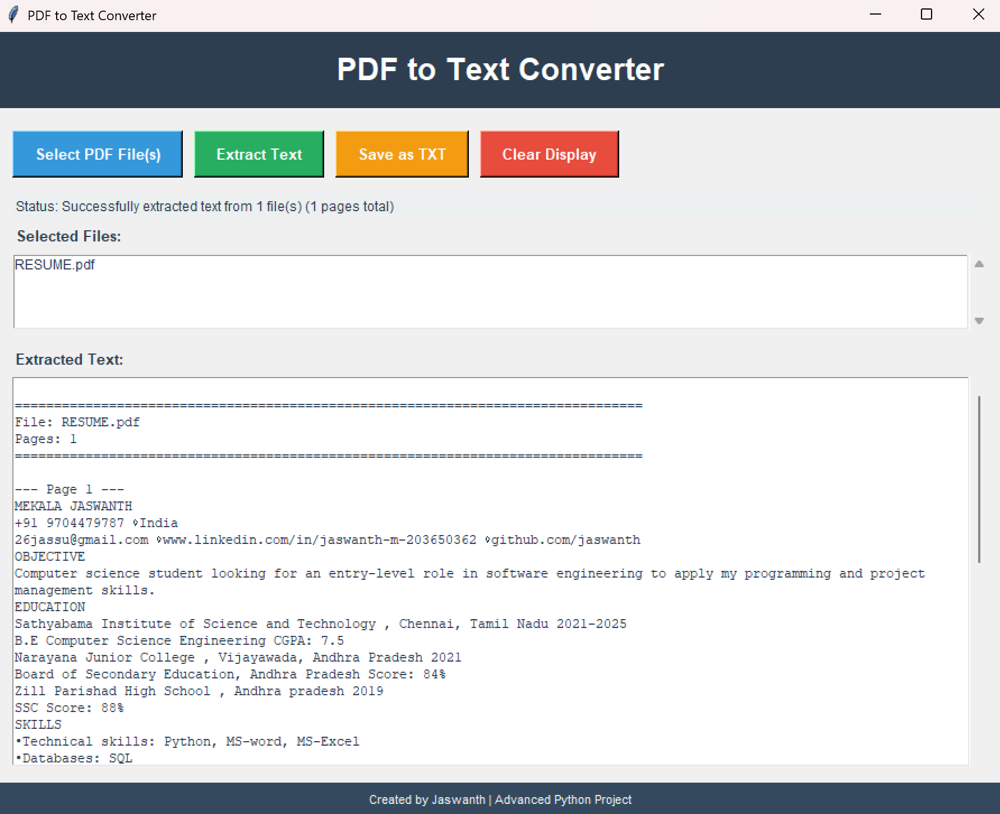

# PDF to Text Converter
✅ **Professional Features**
- Intuitive user interface
- Robust error handling
- User feedback system
- Clean code architecture
- Comprehensive documentation
✅ **No External Complexity**
- No machine learning
- No complex algorithms
- No external dependencies beyond PyPDF2
- Pure Python implementation
---
## Contributing
Feel free to fork this repository and submit pull requests for any improvements.
## License
This project is licensed under the MIT License - feel free to use it in your own projects.
## Author
**Jaswanth**
- GitHub: [@MEKALA-JASWANTH](https://github.com/MEKALA-JASWANTH)
---
## Acknowledgments
- PyPDF2 library for PDF processing
- Python Tkinter community for GUI resources
- Advanced Python programming best practices
## Screenshots

**Last Updated**: November 2025  
**Version**: 1.0.0  
**Status**: Production Ready
